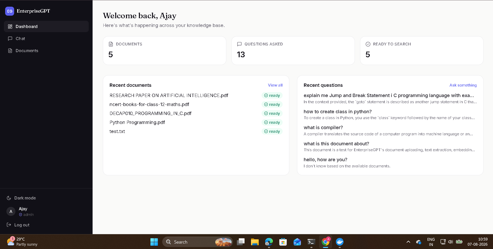
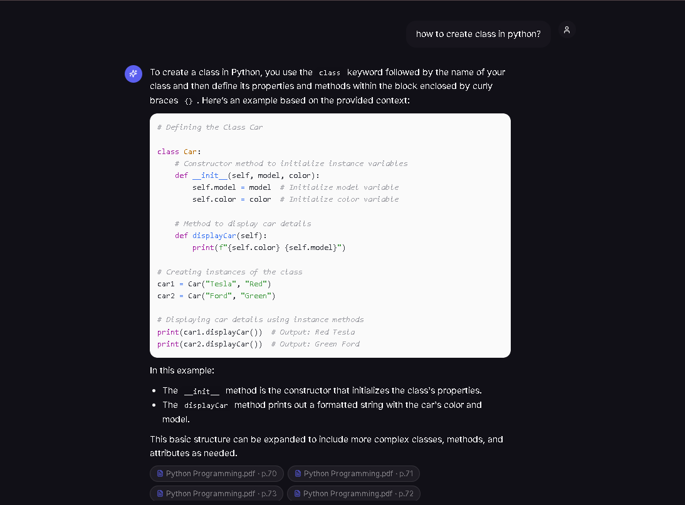
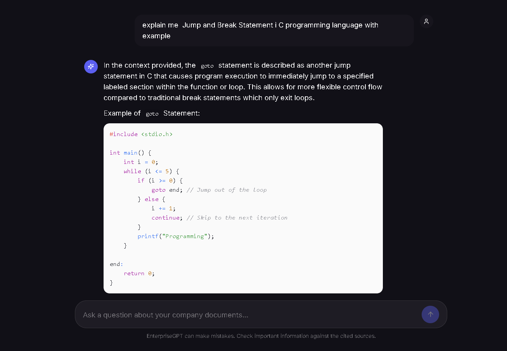
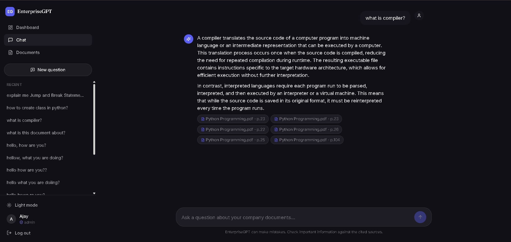

# EnterpriseGPT — Secure Enterprise RAG AI Assistant

A production-style private "ChatGPT for companies": employees upload internal
documents and ask questions in natural language; the assistant answers using
only that company's data, with accurate page-level citations, role-based
access control, and department-aware multi-agent routing.

Built end-to-end across 5 phases — document intelligence pipeline, RAG
question-answering, a full enterprise web UI, advanced AI features
(hybrid search, multi-agent routing, ACL, evaluation, analytics), and
production deployment (Docker, security hardening, monitoring).

## Screenshots

**Dashboard** — documents, question history, and knowledge-base status at a glance


**Chat with citations** — answers grounded in uploaded documents, with page-level source links




## Features

- **Document ingestion pipeline** — PDF/DOCX/TXT/CSV upload, text extraction,
  chunking, embedding (Sentence Transformers), and vector storage in Qdrant.
- **Retrieval-Augmented Generation** — hybrid search (dense vector + BM25
  keyword search, fused via Reciprocal Rank Fusion) feeding a pluggable LLM
  layer (Ollama / OpenAI / Gemini).
- **Multi-agent routing** — a router agent classifies each question into
  HR / Legal / Technical / General and hands it to a specialist agent with
  a tailored system prompt and a narrowed document corpus.
- **Role-based access control + document-level ACL** — Admin/Employee roles,
  department-based document visibility, and explicit per-user permission
  grants that override department rules.
- **Citation-backed answers** — every answer links back to the exact source
  document (and page, for PDFs) it was generated from.
- **RAG evaluation** — RAGAS-based faithfulness / answer-relevancy /
  context-precision scoring, with an automatic heuristic fallback when
  RAGAS isn't installed.
- **Analytics dashboard** — question volume, department/agent breakdown,
  top topics, failure rate, most active users.
- **JWT authentication with refresh-token rotation** — short-lived access
  tokens, long-lived rotating refresh tokens, server-side revocation
  (logout-everywhere), and reuse detection.
- **Rate limiting** — Redis-backed, per-route limits on expensive endpoints
  (chat, upload, auth).
- **Fully Dockerized** — one command (`docker compose up -d`) brings up the
  entire stack: Next.js frontend, FastAPI backend, PostgreSQL, Qdrant, and
  Redis.

## Tech stack

| Layer | Technology |
|---|---|
| Frontend | Next.js 14, TypeScript, Tailwind CSS |
| Backend | FastAPI, async SQLAlchemy, Alembic, Pydantic |
| Database | PostgreSQL |
| Vector store | Qdrant |
| Caching / rate limiting | Redis |
| Embeddings | Sentence Transformers (`all-MiniLM-L6-v2`) |
| LLM | Ollama (local) / OpenAI / Gemini — pluggable |
| Auth | JWT (access + rotating refresh tokens) |
| Deployment | Docker, Docker Compose |

## Architecture

```
                         question
                            │
                            ▼
                  ┌───────────────────┐
                  │   ACL service      │  which docs can this user see?
                  └─────────┬─────────┘
                            ▼
                  ┌───────────────────┐
                  │   Router Agent     │  HR / Legal / Technical / General
                  └─────────┬─────────┘
                            ▼
              ┌─────────────────────────────┐
              │       Hybrid Search          │
              │  Qdrant vector search  ──┐    │
              │  Postgres BM25 search  ──┼─▶ RRF fusion
              └─────────────────────────────┘
                            ▼
             specialist system prompt + context
                            │
                            ▼
                      LLM generation
                            │
                            ▼
              answer + citations + analytics log
```

## Getting started

### Prerequisites
- Docker + Docker Compose
- (Optional, for local LLM) [Ollama](https://ollama.com) running on the host

### Run everything with Docker

```bash
cd backend
cp .env.example .env        # fill in real values (SECRET_KEY, etc.)
docker compose up -d
```

This starts PostgreSQL, Qdrant, Redis, the FastAPI backend, and the Next.js
frontend, all networked together.

- Frontend: http://localhost:3000
- Backend API docs (Swagger): http://localhost:8000/docs

### First-time setup

The first user to register automatically becomes an **admin**:

```bash
curl -X POST http://localhost:8000/api/v1/auth/register \
  -H "Content-Type: application/json" \
  -d '{"email":"admin@example.com","password":"changeme123","full_name":"Admin","department":"general"}'
```

Then log in through the frontend, upload a document, and start asking
questions.

### Running migrations manually (if needed)

```bash
docker compose exec backend python -m alembic upgrade head
```

## Project structure

```
backend/
  app/
    api/          # FastAPI route handlers
    models/       # SQLAlchemy ORM models
    schemas/      # Pydantic request/response schemas
    services/     # business logic (RAG, ACL, agents, embeddings, etc.)
    core/         # config, security, rate limiting
  alembic/         # database migrations
frontend/
  src/
    app/           # Next.js pages (dashboard, chat, documents, auth)
    components/    # shared UI components
    lib/            # API client, auth context
docs/
  screenshots/     # README images
```

## License

This project was built as a learning/portfolio project demonstrating a
production-style RAG system architecture.
